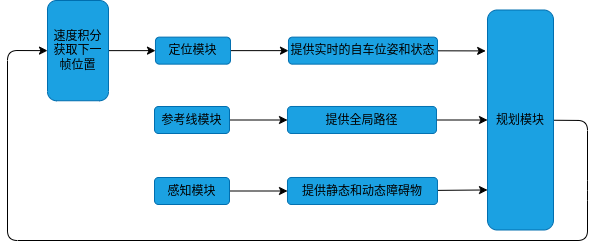
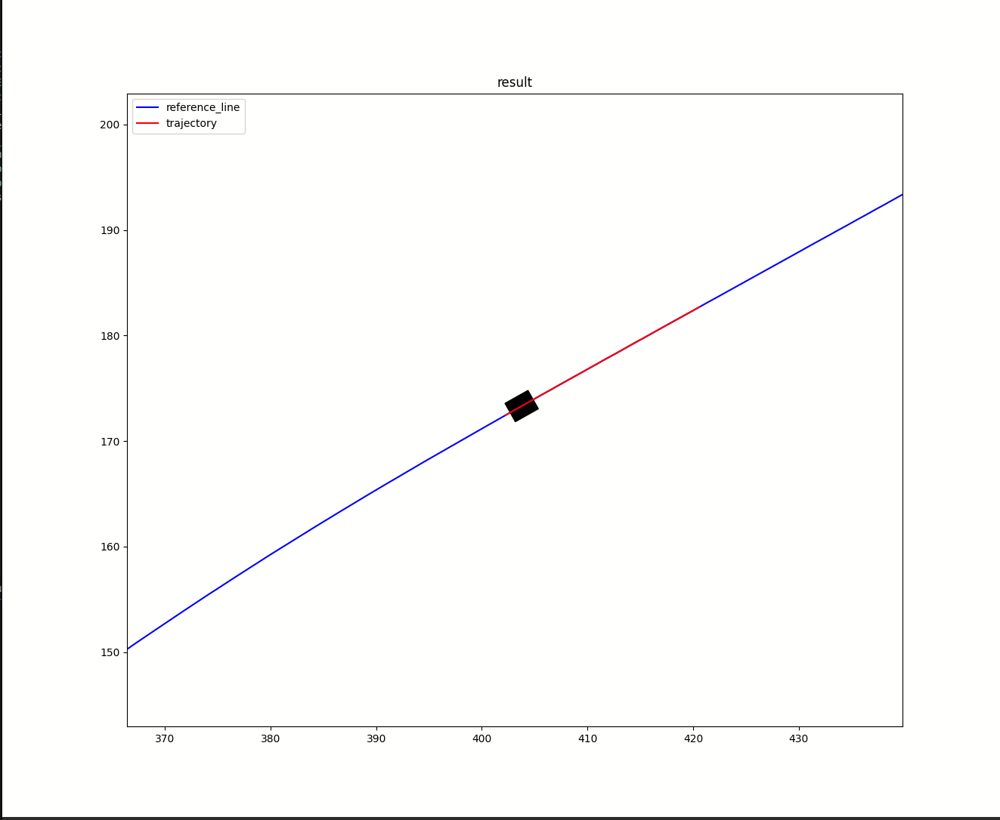
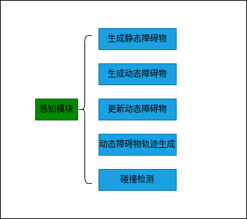
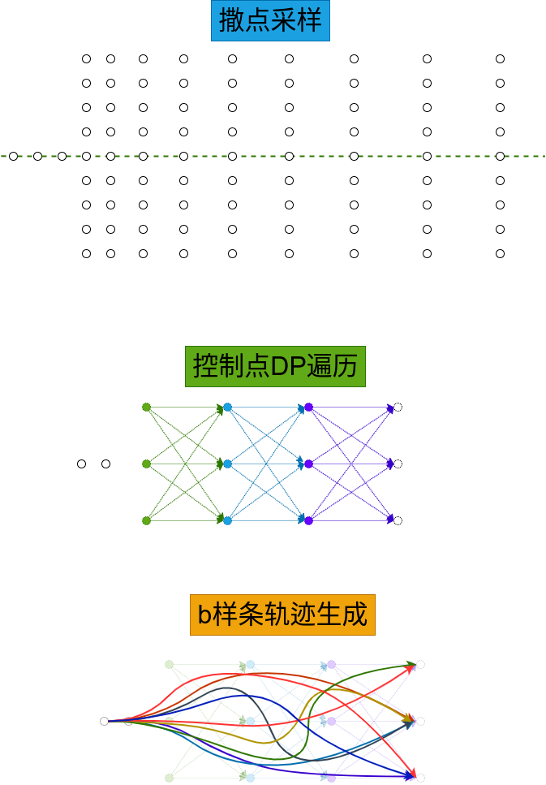
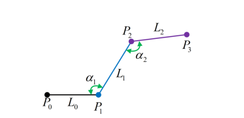
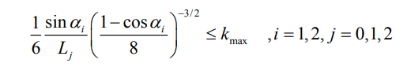

# 功能概述
1.开发一个规划器，实现避障，可根据规则进行规划。
2.提供一个简单的仿真环境，用matplotlib-cpp进行绘图，仿真环境提供原始全局路径和静态与动态障碍物。

# 一、框架搭建
按照由外到里的原则，先构思main函数需要实现的功能，再构思需要哪些功能模块，最后再细化每个功能模块的具体函数。先把主要的函数接口搭建好，跑通整个流程。

## 1.搭建整体框架


按照这个流程图，先搭建主要的框架，不实现具体功能，如下：

```c++
int main() {
  // 指定读取的路线
  std::string dir = "/home/ahrs/workspace/nday/bspline_lattice_planner/map/";
  std::string map_name = "berlin_2018.csv";
  std::string file_name = dir + map_name;
  //读取路线作为参考线
  ReferenceLine reference_line = LoadRoadInfo(file_name);
  if (reference_line.GetPoints().empty()) {
    return 0;
  }
  //感知模块，负责查询障碍物信息
  Environment environment;
  //轨迹规划器
  BsplineLatticePlanner planner;
  //机器人状态
  Point start = reference_line.GetPoints().front();
  RobotState robot_state(start.x_, start.y_, start.theta_);
  //规划结果
  Curve trajectory;
  //可视化模块
  Visualization visualization;
  //车体参数等配置
  Config config;
  DebugInfo debug_info;

  while (true) {
    //更新参考线
    reference_line.Update(robot_state);
    //更新障碍物信息
    environment.Update(robot_state);
    //规划器求解轨迹
    bool res = planner.Plan(robot_state, reference_line, environment,
                            trajectory, config, debug_info);
    //更新机器人的位置（假设机器人能够完美跟踪规划出来的轨迹）
    UpdateRobotState(robot_state, trajectory);
    //可视化当前帧计算结果
    visualization.ShowResult(reference_line, environment, robot_state,
                             trajectory, config, debug_info);
  }

  return 0;
}
```
初步仿真效果如图所示:



本次框架的commit: 64d07795efe4f5e53ffe79a6152492e0971f64ca


## 2.搭建感知模块框架

主要是为仿真提供一些障碍物，包括静态障碍物和动态障碍物，其次要提供碰撞检测的功能



### 2.1 可视化类的初步构建
```c++
  void DrawCircle(const double& x, const double& y, const double& radius,
                  const std::string& color);
  void DrawCar(const RobotState& state, const Config& config,
               const std::string& color);
  void DrawPolygon(const double& x, const double& y, const double& theta,
                   const Config& config, const std::string& color,
                   const bool& fill = true);
  void DrawPolygon(const double& x, const double& y, const double& theta,
                   const double& tail, const double& front, const double& width,
                   const std::string& color, const bool& fill = true);
  void DrawPolygon(const Polygon2d& polygon, const std::string& color,
                   const bool& fill = true);
  void ShowPoints(const std::vector<Point>& points, const std::string& name,
                  const std::string& color, const Config& config,
                  const bool& show_car = false);
  void ShowResult(const ReferenceLine& line, const Environment& env,
                  const RobotState& state, const Curve& trajectory,
                  const Config& config, const DebugInfo& debug_info);
  void ShowObstacle(const Environment& env);
```

### 2.2 动静态障碍物生成
```c++
  Environment(const ReferenceLine& reference_line, const Config& config);
  // tip:将A类作为B类的构造函数参数，A类的构造函数有什么要求
  void Update(const RobotState& state);
  void GenerateObstacle();
  std::vector<Obstacle> StaticObstacle() const;
  std::vector<Obstacle> DynamicObstacle() const;
```

### 仿真效果

生成动态和静态障碍物，动态障碍物根据障碍物的速度，每一个周期都会更行其位置和polygon。可视化可以显示全局感知信息，以及车体和轨迹。
这里规划模块仅仅预留了主要接口，并未实现，演示中的轨迹，其实就是直接截取的参考线，没有避让障碍物。


本次commit为： 115f9d4ca578f6baadd008cc84098a72dcacbab1

# 二、核心规划模块设计

## 1.横向轨迹采样

### 1.1 撒点采样
- 垂直参考线撒点，撒点宽度默认，但是不能大于转弯半径
- 检查到狭窄空间，撒点加密
- 近密远疏
- 起点采样角度
### 1.2 动态规划遍历
遍历第零层到最后一层所有连接可能，形成控制点序列集合
### 1.3 筛选器初步过滤
- 碰撞过滤：根据b样条的凸包性，检测控制点凸包与多边形障碍物是否有交集
- 曲率过滤：根据控制点和曲率关系，计算近似曲率，进行筛选




> Safe and Efficient Trajectory Optimization for
Autonomous Vehicles using B-Spline with
Incremental Path Flattening

> Continuous Path Smoothing for Car-Like Robots Using B-Spline Curves

### 1.4 评价函数
- 平滑度
- 最近障碍物距离
- 规则：靠左，靠右，居中，跟车
- 动态障碍物碰撞风险
- 轨迹一致性
### 1.5 dp结果打分排序
根据评价函数，将所有结果按照评分，存储在优先级队列中
### 1.6 有效轨迹集生成
- 可视化轨迹：生成所有的轨迹用于可视化
- 生成最优轨迹
### 1.7 重规划
重规划条件：
- 前方20m轨迹出现碰撞
- 碰撞风险增加到一定阈值
- 自车偏离轨迹20cm以上
### 1.8 轨迹拼接
- 自车位置向前预估0.1s
- 上一帧轨迹向前预估0.1s
不过实际应用中，如果定位抖得比较厉害，拼接是没有用的。

## 2.速度规划

