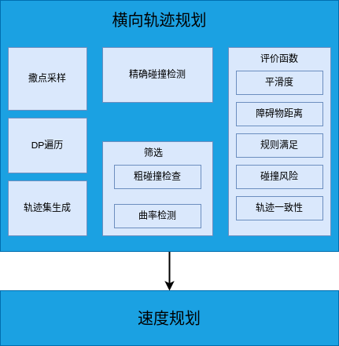
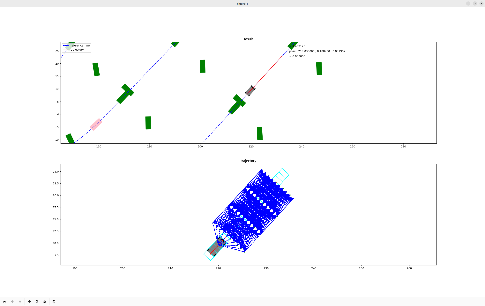
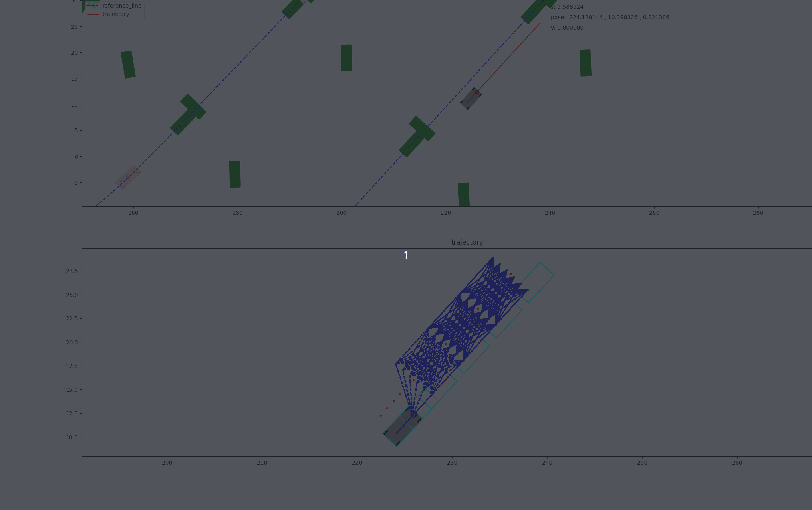

# 功能概述

1.开发一个规划器，实现避障，可根据规则进行规划。
2.提供一个简单的仿真环境，用matplotlib-cpp进行绘图，仿真环境提供原始全局路径和静态与动态障碍物。

# 一、框架搭建

按照由外到里的原则，先构思main函数需要实现的功能，再构思需要哪些功能模块，最后再细化每个功能模块的具体函数。先把主要的函数接口搭建好，跑通整个流程。

## 1.搭建整体框架


按照这个流程图，先搭建主要的框架，不实现具体功能，如下：

```c++
int main() {
  // 指定读取的路线
  std::string dir = "/home/ahrs/workspace/nday/bspline_lattice_planner/map/";
  std::string map_name = "berlin_2018.csv";
  std::string file_name = dir + map_name;
  //读取路线作为参考线
  ReferenceLine reference_line = LoadRoadInfo(file_name);
  if (reference_line.GetPoints().empty()) {
    return 0;
  }
  //感知模块，负责查询障碍物信息
  Environment environment;
  //轨迹规划器
  BsplineLatticePlanner planner;
  //机器人状态
  Point start = reference_line.GetPoints().front();
  RobotState robot_state(start.x_, start.y_, start.theta_);
  //规划结果
  Curve trajectory;
  //可视化模块
  Visualization visualization;
  //车体参数等配置
  Config config;
  DebugInfo debug_info;

  while (true) {
    //更新参考线
    reference_line.Update(robot_state);
    //更新障碍物信息
    environment.Update(robot_state);
    //规划器求解轨迹
    bool res = planner.Plan(robot_state, reference_line, environment,
                            trajectory, config, debug_info);
    //更新机器人的位置（假设机器人能够完美跟踪规划出来的轨迹）
    UpdateRobotState(robot_state, trajectory);
    //可视化当前帧计算结果
    visualization.ShowResult(reference_line, environment, robot_state,
                             trajectory, config, debug_info);
  }

  return 0;
}
```

初步仿真效果如图所示:


本次框架的commit: 64d07795efe4f5e53ffe79a6152492e0971f64ca

## 2.搭建感知模块框架

主要是为仿真提供一些障碍物，包括静态障碍物和动态障碍物，其次要提供碰撞检测的功能


### 2.1 可视化类的初步构建

```c++
  void DrawCircle(const double& x, const double& y, const double& radius,
                  const std::string& color);
  void DrawCar(const RobotState& state, const Config& config,
               const std::string& color);
  void DrawPolygon(const double& x, const double& y, const double& theta,
                   const Config& config, const std::string& color,
                   const bool& fill = true);
  void DrawPolygon(const double& x, const double& y, const double& theta,
                   const double& tail, const double& front, const double& width,
                   const std::string& color, const bool& fill = true);
  void DrawPolygon(const Polygon2d& polygon, const std::string& color,
                   const bool& fill = true);
  void ShowPoints(const std::vector<Point>& points, const std::string& name,
                  const std::string& color, const Config& config,
                  const bool& show_car = false);
  void ShowResult(const ReferenceLine& line, const Environment& env,
                  const RobotState& state, const Curve& trajectory,
                  const Config& config, const DebugInfo& debug_info);
  void ShowObstacle(const Environment& env);
```

### 2.2 动静态障碍物生成

```c++
  Environment(const ReferenceLine& reference_line, const Config& config);
  // tip:将A类作为B类的构造函数参数，A类的构造函数有什么要求
  void Update(const RobotState& state);
  void GenerateObstacle();
  std::vector<Obstacle> StaticObstacle() const;
  std::vector<Obstacle> DynamicObstacle() const;
```

### 仿真效果

生成动态和静态障碍物，动态障碍物根据障碍物的速度，每一个周期都会更行其位置和polygon。可视化可以显示全局感知信息，以及车体和轨迹。
这里规划模块仅仅预留了主要接口，并未实现，演示中的轨迹，其实就是直接截取的参考线，没有避让障碍物。


本次commit为： 115f9d4ca578f6baadd008cc84098a72dcacbab1

# 二、核心规划模块设计



## 1.横向轨迹采样


### 1.1 撒点采样

- 垂直参考线撒点，撒点宽度默认，但是不能大于转弯半径
- 检查到狭窄空间，撒点加密
- 近密远疏
- 起点采样角度

### 1.2 遍历所有解

遍历第零层到最后一层所有连接可能，形成控制点序列集合.

#### 1.2.1 dp方法

dp方法遍历了所有解，得到最多解，但是如果想要获得所有可能路径的集合，就不太方便了。

#### 1.2.2 dfs方法

根本上就是一个二叉树所有路径的问题，遍历所有路径有多种写法。
> <https://leetcode.cn/problems/binary-tree-paths/description/>

##### (1) 深度优先搜索(递归写法)

然而，尽管代码有适当的终止条件，深度优先搜索（DFS）的本质意味着如果图非常大或非常密集，它可能会导致很深的递归层次，进而可能导致栈溢出错误。这不是无限递归，而是资源限制导致的潜在问题。优化递归深度或考虑使用迭代方法（如使用栈实现的非递归DFS）可能有助于解决这一问题。

总之，这段代码设计有适当的递归退出机制，不应该导致无限递归。但在处理大型图时，深度优先搜索的递归深度可能会成为性能瓶颈或资源限制的问题。
目前dfs版本有问题，无法结束计算。

##### (2) 深度优先搜索(栈写法)

用栈的写法来优化一下。
关键变化
栈的使用：我们使用一个栈来存储待访问的节点以及到达该节点的路径。栈中的每个元素是一个包含节点指针和到达该节点的路径的pair。
循环而非递归：通过使用栈，我们将原本的递归调用转换为一个循环过程。在每次循环中，我们从栈中取出一个节点和路径，对该节点进行处理，然后将其邻居节点加入栈中以供后续访问。
访问标记管理：在访问每个节点前，我们检查其是否已经被访问过，以避免重复处理。在处理完节点后，我们标记该节点为已访问，但在将邻居节点添加到栈之前，我们再次检查邻居节点是否被访问过，以避免将已访问的节点加入栈中。
路径管理：我们在栈中存储到当前节点的路径，每当从栈中取出一个元素时，我们复制该路径并添加当前节点，确保了每条路径的独立性。
优势
避免栈溢出：使用栈显式管理节点访问可以有效避免因递归调用深度过大而导致的栈溢出问题。
灵活控制：这种方法使得我们能够更灵活地控制节点的访问顺序和路径的构建过程。
这种基于栈的DFS实现避免了递归的潜在栈溢出问题，特别适用于处理大型图结构。

结果上看，dfs和栈的实现没啥问题，就是本身计算量太大了，这里要想办法优化才行。


##### (3) 离线计算优化

所有路径的计算，可以离线生成，在线只需要重新设置每个index的pos即可。

##### (4) 减枝

碰撞减枝、曲率减枝

#### 1.2.2 动态规划和dfs的效率分析

为什么dp可以做到实时计算，而dfs就因为递归深度导致无法计算呢。这里理解了，就彻底掌握了这两种算法思想了。

### 1.3 筛选器初步过滤

- 碰撞过滤：根据b样条的凸包性，检测控制点凸包与多边形障碍物是否有交集
- 曲率过滤：根据控制点和曲率关系，计算近似曲率，进行筛选


> Safe and Efficient Trajectory Optimization for
Autonomous Vehicles using B-Spline with
Incremental Path Flattening

> Continuous Path Smoothing for Car-Like Robots Using B-Spline Curves

### 1.4 评价函数

- 平滑度
- 最近障碍物距离
- 规则：靠左，靠右，居中，跟车
- 动态障碍物碰撞风险
- 轨迹一致性

```c++
class TrajectoryScorer {
 public:
  TrajectoryScorer() {}
  double GetScorer(const std::vector<Node2d>& path, const Environment& env,
                   const Config& config);
  double SmoothTerm(const std::vector<Node2d>& path, const Environment& env,
                    const Config& config);
  double SafeTerm(const std::vector<Node2d>& path, const Environment& env,
                  const Config& config);
  double TrafficTerm(const std::vector<Node2d>& path, const Environment& env,
                     const Config& config);
  double CurvatureTerm(const std::vector<Node2d>& path, const Environment& env,
                       const Config& config);
  double ConsistencyTerm(const std::vector<Node2d>& path,
                         const Environment& env, const Config& config);
};
```

### 1.5 控制点集合结果打分排序

根据评价函数，将所有结果按照评分，存储在vector(优先级队列)中

```c++
std::vector<CostPath> BsplineLatticePlanner::SamplesScore(
    const std::vector<std::vector<Node2d>>& ctp_seq, const Environment& env,
    const Config& config) {
  std::vector<CostPath> sort_vec;
  TrajectoryScorer scorer;
  double cost = 0.0;
  for (auto& seq : ctp_seq) {
    cost = scorer.GetScorer(seq, env, config);
    sort_vec.emplace_back(CostPath(cost, seq));
  }

  std::sort(sort_vec.begin(), sort_vec.end(), CostPath::CompareCost());
  return sort_vec;
}
```

当前效果如下，选择了最右的控制点序列，目前轨迹暂时用控制点表示了


### 1.6 有效轨迹集生成

next to do

- 可视化轨迹：生成所有的轨迹用于可视化
- 生成最优轨迹

### 1.7 重规划

重规划条件：

- 前方20m轨迹出现碰撞
- 碰撞风险增加到一定阈值
- 自车偏离轨迹20cm以上

### 1.8 轨迹拼接

- 自车位置向前预估0.1s
- 上一帧轨迹向前预估0.1s
不过实际应用中，如果定位抖得比较厉害，拼接是没有用的。

## 2.速度规划
