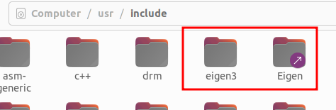

## 1.vscode代码格式化配置
生成格式化文件.clang-format
```
// 查找clang-format安裝位置
which clang-format
// 或者直接安裝
sudo apt install clang-format
// 生成谷歌格式
/usr/bin/clang-format -style=google -dump-config > /home/用户名/.clang-format
```

新建setting.json文件
```
//vscode界面输入
ctrl+shift+p
//搜索如下关键词
open workspace settings
```
配置.vscode/setting.json
```
{
    "clang-format.style": "file",
    "clang-format.assumeFilename": "./.clang-format",
    "clang-format.executable": "/usr/bin/clang-format",
    "clang-format.fallbackStyle": "Google",
    "editor.defaultFormatter": "xaver.clang-format"
}
```
## 2.配置gitignore
初始化git
```
git init
```
在根目录添加.gitignore文件
如果是git add之后才想起来添加.gitignore，或者修改了.gitignore，需要
```
git rm -r cached .
git add .
git commit -m 'update .gitignore'
```

```
git clone --recurse-submodules <**.git>
git checkout dev / master
mkdir build
cd build
cmake ..
make -j
```

## 3.配置launch.json和tasks.json

## 参考资料
https://github.com/bryanibit/LatticePlannerWithFrenet
https://github.com/gaows123/SpatiotemporalPlanningFramework
https://github.com/gaows123/CartesianPlanner/tree/main/src

## 问题记录
### python
cmake 需要3.12以上
https://m.tsingfun.com/it/cpp/Missing-FindPython3-cmake.html
python3需要3.8

安装Python 3.8
Ubuntu 20.04及更高版本默认已经安装了Python 3.8。如果你使用的是这些版本，可以直接跳到安装NumPy的步骤。如果你使用的是旧版本的Ubuntu，可以按照以下步骤安装Python 3.8：

1.打开终端。
2.更新包列表以确保可以访问到最新的版本：
```
sudo apt update
sudo apt install python3.8
```
3.（可选）如果你想将Python 3.8设置为默认的Python版本，可以更新python3的替代版本。首先，安装update-alternatives工具：
```
sudo apt install update-alternatives
添加Python 3.8作为update-alternatives的一个选项：
sudo update-alternatives --install /usr/bin/python3 python3 /usr/bin/python3.8 1
使用update-alternatives配置Python版本：
sudo update-alternatives --config python3

```
安装NumPy
安装好Python 3.8之后，可以使用pip来安装NumPy。由于我们使用的是Python 3.8，确保使用的是对应版本的pip（pip3）：
```
python3.8 -m pip install --upgrade pip
python3.8 -m pip install numpy
```
这样就完成了Python 3.8和NumPy的安装。你可以通过运行以下命令来验证NumPy是否成功安装：
```
python3.8 -c "import numpy; print(numpy.__version__)"
```

pip install matplotlib


## 新电脑安装
### cmake和编译器
```
sudo apt install cmake
sudo apt update
sudo apt install build-essential
```

### python等
sudo apt install python3-dev
sudo apt install python3-pip
python3 -m pip install numpy

### eigen
```
sudo apt update
sudo apt install libeigen3-dev
```


### osqp
```
git clone --recursive https://github.com/oxfordcontrol/osqp
cd osqp
mkdir build && cd build
cmake -G "Unix Makefiles" ..
sudo make install
```

### osqp-eigen
```
git clone https://github.com/robotology/osqp-eigen.git
cd osqp-eigen
mkdir build
cd build
cmake -DCMAKE_INSTALL_PREFIX:PATH=<custom-folder> ../
make
make install
```

### matplotlib
```
pip3 install matplotlib
```

## Eigen的使用和报错解决

```
find_package(Eigen3 REQUIRED)
include_directories (${EIGEN3_INCLUDE_DIR})
```

注意：Eigen默认安装位置是/usr/include/eigen3(也可能在/usr/local/include/eigen3)，但是很多开源项目引用头文件的时候，是省略eigen3的，即：
```
#include <eigen3/Eigen/Dense> 
#include <Eigen/Dense>        //省略eigen3
```

如果用到了其他三方库，库里头文件包含的是省略eigen3的写法，改动源码不方便，可以通过增加软连接的方式来解决这个问题

```
//查看eigen3安装位置
locate eigen3
//我的安装在/usr/include/eigen3

//建立软连接
sudo ln -s /usr/include/eigen3 /usr/include/Eigen
```
可以看到，多了一个Eigen目录：
